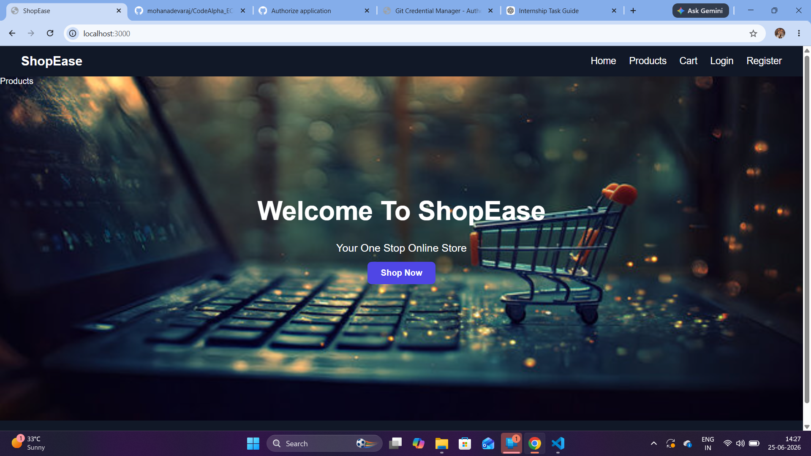
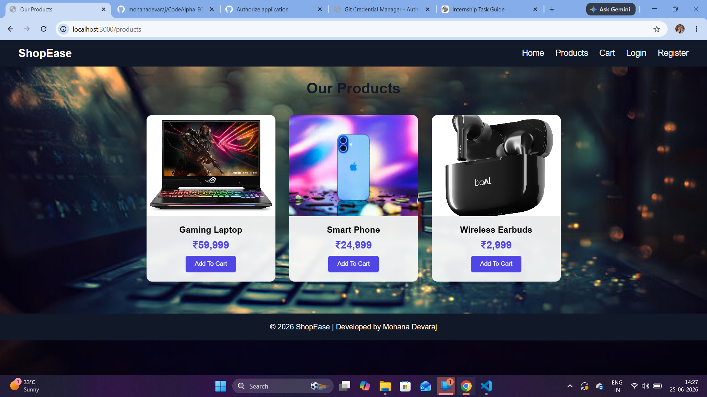
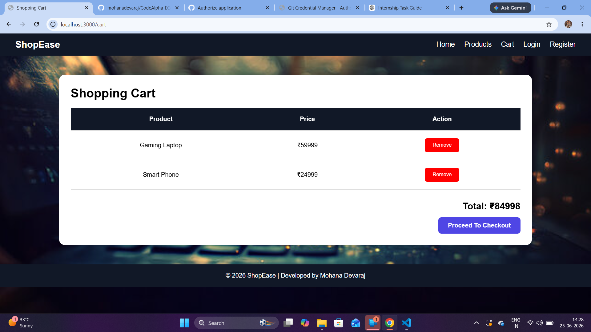
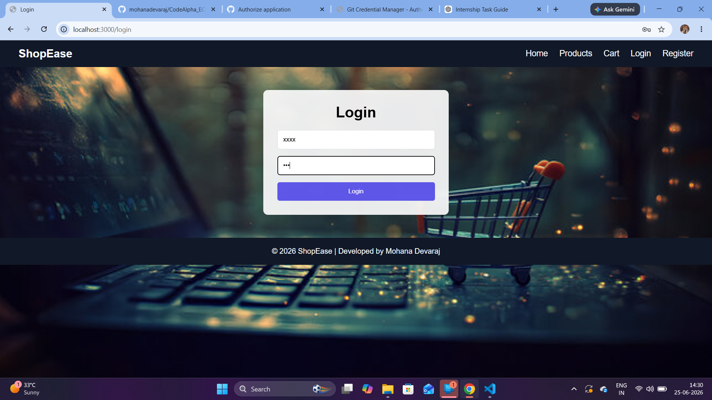
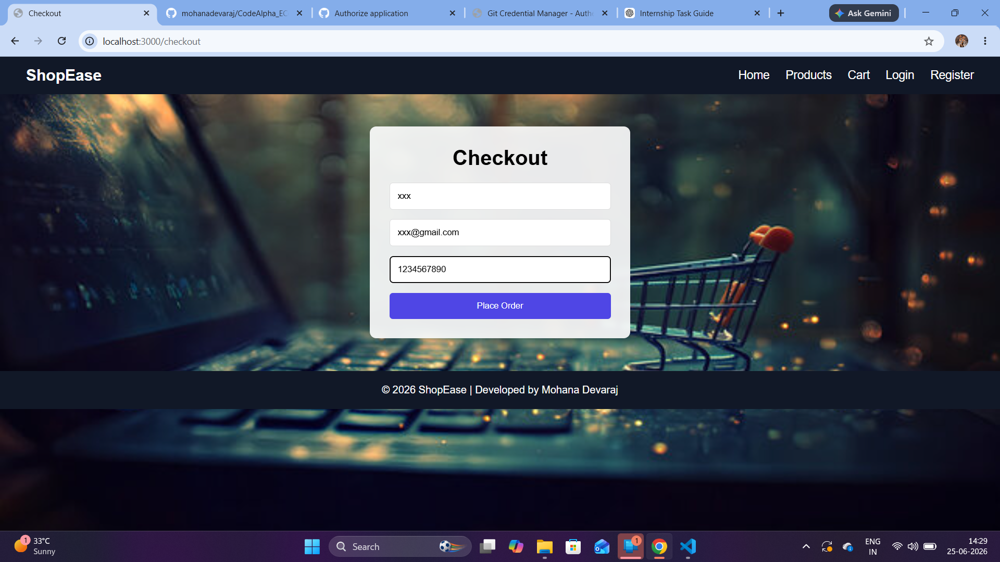
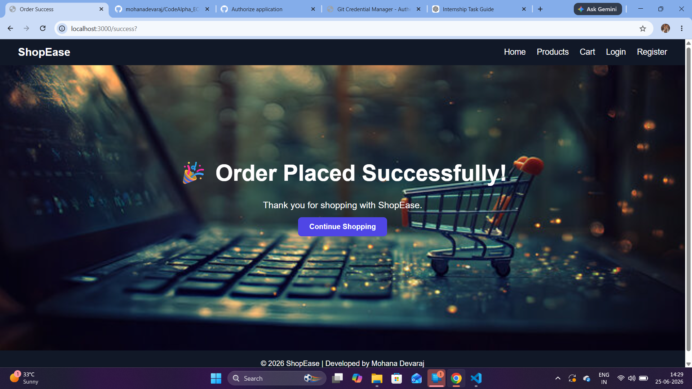
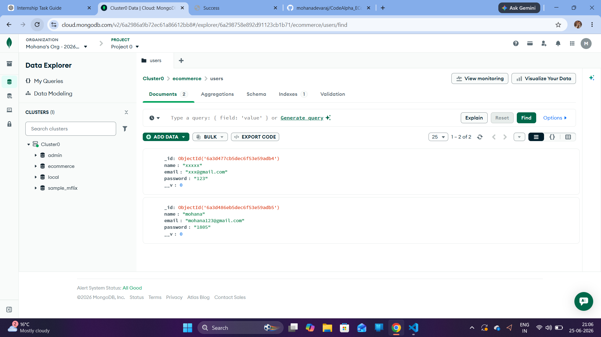

# 🛒 ShopEase - E-Commerce Website

A responsive Full Stack E-Commerce Website developed using **Node.js**, **Express.js**, **EJS**, **MongoDB**, **HTML**, **CSS**, and **JavaScript**.

## 📌 Project Overview

ShopEase is an online shopping platform that allows users to browse products, add items to the cart, register, log in, and place orders through a simple and user-friendly interface.

---

## 🚀 Features

* 🏠 Attractive Home Page
* 🛍️ Product Listing Page
* 📄 Product Details Page
* 🛒 Dynamic Shopping Cart
* 👤 User Registration
* 🔐 User Login
* ✅ Login & Registration Success Messages
* 💳 Checkout Page
* 🎉 Order Success Page
* 📱 Responsive Design

---

## 🛠️ Technologies Used

### Frontend

* HTML5
* CSS3
* JavaScript
* EJS (Embedded JavaScript Templates)

### Backend

* Node.js
* Express.js

### Database

* MongoDB Atlas
* Mongoose

---

## 📂 Project Structure

```text
CodeAlpha_ECommerceStore/
│
├── config/
│   └── db.js
├── public/
│   ├── css/
│   └── images/
├── views/
│   ├── home.ejs
│   ├── products.ejs
│   ├── product.ejs
│   ├── cart.ejs
│   ├── login.ejs
│   ├── register.ejs
│   ├── checkout.ejs
│   └── success.ejs
├── screenshots/
├── server.js
├── package.json
├── package-lock.json
└── README.md
```

---

## 📸 Screenshots

### Home Page



### Products Page



### Shopping Cart



### Register Page


### Registration Success


### Login Page



### Checkout Page



### Order Success Page



## User Data in MongoDB Atlas



---

## ⚙️ Installation and Setup

### Clone the Repository

```bash
git clone https://github.com/mohanadevaraj/CodeAlpha_ECommerceStore.git
```

### Move to Project Directory

```bash
cd CodeAlpha_ECommerceStore
```

### Install Dependencies

```bash
npm install
```

### Run the Application

```bash
node server.js
```

Open the browser and visit:

```text
http://localhost:3000
```

---

## 🎯 Future Enhancements

* User Authentication with Sessions
* Product Search and Filters
* Payment Gateway Integration
* Order History
* Admin Dashboard
* Wishlist Feature

---

## 👨‍💻 Developed By

**Mohana Devaraj**

Full Stack Web Development Intern at **CodeAlpha**

---

## 🔗 GitHub Repository

https://github.com/mohanadevaraj/CodeAlpha_ECommerceStore

---


# ShopEase - E-Commerce Website

A responsive E-Commerce website developed using:

- Node.js
- Express.js
- EJS
- CSS
- MongoDB

## Features
✅ Home Page
✅ Product Listing
✅ Product Details
✅ Add to Cart
✅ Dynamic Shopping Cart
✅ Login and Registration
✅ Order Success Page
✅ Responsive Design

## License

This project is developed for learning purposes and as part of the **CodeAlpha Full Stack Development Internship**.

## Installation

```bash
npm install
npm start
